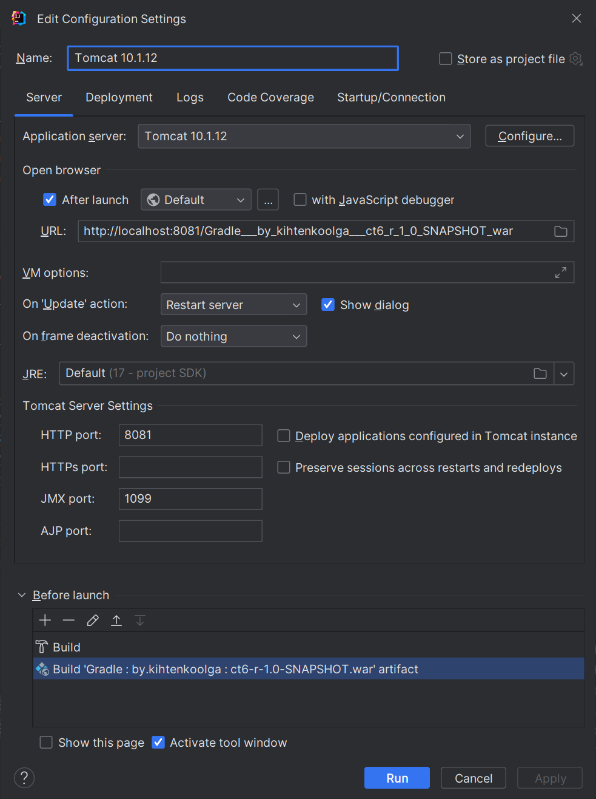

## Технологии
  - Java 17
  - Gradle 8.4
  - Lombok
  - Mapstruct
  - JDBC
  - SnakeYAML
  - Hikari
  - PostgreSql
  - Aspectj
  - Jackson 
  - Jaxb 
  - Mockito
  - Junit 5
  - Assertj
  - Validation (org.glassfish.javax.el with hibernate-validator)
  - Tomcat 10.1.12

## Подключение
- В файле [application.yaml](src%2Fmain%2Fresources%2Fapplication.yaml) 
  - настройки подключения к БД
      ```yaml 
      url: jdbc:postgresql://localhost:3254/refl-task
      username: postgres
      password: postgres
      init-tables-with-data: true
      ```
  - настройки кэша 
    ```yaml
    cache:
        algorithm-type: LFU
        capacity: 13
    ```
- Скрипт создания таблицы БД: [schema.sql](src%2Fmain%2Fresources%2Fschema.sql)
- Скрипт заполнения таблицы БД: [data.sql](src%2Fmain%2Fresources%2Fdata.sql)

## Настройка


## Запуск
1. Build
```
   ./gradlew clean
   ./gradlew build
```
2. Запустить __ct6-r-1.0-SNAPSHOT.war__ в tomcat
## Endpoints
### 0. GET - получение чека
- Количество страниц по умолчанию:  http://localhost:8081/Gradle___by_kihtenkoolga___ct6_r_1_0_SNAPSHOT_war/users/report?command=REPORT_USERS_FIND_ALL
- Количество страниц и размер заданы:  http://localhost:8081/Gradle___by_kihtenkoolga___ct6_r_1_0_SNAPSHOT_war/users/report?command=REPORT_USERS_FIND_ALL&pageNumber=1&pageSize=3
### 1. GET - findAll with PageSize and PageNumber
http://localhost:8081/Gradle___by_kihtenkoolga___ct6_r_1_0_SNAPSHOT_war/users?pageNumber=1&pageSize=3&command=USERS_FIND_ALL

### 2. GET - findAll (default)
http://localhost:8081/Gradle___by_kihtenkoolga___ct6_r_1_0_SNAPSHOT_war/users?command=USERS_FIND_ALL

### 3. GET - findById
http://localhost:8081/Gradle___by_kihtenkoolga___ct6_r_1_0_SNAPSHOT_war/users?id=f7eddb3d-a48e-4678-b553-b6b2ddead2f2&command=USERS_FIND_BY_ID

### 4. POST - create
http://localhost:8081/Gradle___by_kihtenkoolga___ct6_r_1_0_SNAPSHOT_war/users?command=USERS_CREATE
```json
{
    "name":"Name",
    "surname":"Surname",
    "phone":"+375259873453"
}
```

### 5. PUT - update
http://localhost:8081/Gradle___by_kihtenkoolga___ct6_r_1_0_SNAPSHOT_war/users?command=USERS_UPDATE
```json
{
  "id": "f7eddb3d-a48e-4678-b553-b6b2ddead2f2",
  "name": "Newname",
  "surname": "Newsurname",
  "phone": "+375259873453"
}
```

### 6. DELETE - deleteById
http://localhost:8081/Gradle___by_kihtenkoolga___ct6_r_1_0_SNAPSHOT_war/users?id=56326b1f-040a-46b0-a131-46b7c984af71&command=USERS_DELETE_BY_ID

## Описание
- [YamlApplicationProperties.java](src%2Fmain%2Fjava%2Fby%2Fkihtenkoolga%2Futil%2Fproperty%2FYamlApplicationProperties.java) - для считывания настроек из application.yaml
- [PdfUtil.java](src%2Fmain%2Fjava%2Fby%2Fkihtenkoolga%2Futil%2Ffactory%2Fimpl%2FPdfUtil.java)
- [JsonUtil.java](src%2Fmain%2Fjava%2Fby%2Fkihtenkoolga%2Futil%2Ffactory%2Fimpl%2FJsonUtil.java) - для получения данных из json 
- [XmlUtil.java](src%2Fmain%2Fjava%2Fby%2Fkihtenkoolga%2Futil%2Ffactory%2Fimpl%2FXmlUtil.java) - для получения данных их xml
  - [UserDto.java](src%2Fmain%2Fjava%2Fby%2Fkihtenkoolga%2Fdto%2FUserDto.java) содержит __@XmlRootElement__ для работы с xml
- Пул соединений БД: [DataSource.java](src%2Fmain%2Fjava%2Fby%2Fkihtenkoolga%2Fconfig%2FDataSource.java)
- Чтение и выполнение sql скриптов: [DbScriptUtil.java](src%2Fmain%2Fjava%2Fby%2Fkihtenkoolga%2Futil%2FDbScriptUtil.java)
- [InitContextListener.java](src%2Fmain%2Fjava%2Fby%2Fkihtenkoolga%2Flistener%2FInitContextListener.java)
- [EncodingFilter.java](src%2Fmain%2Fjava%2Fby%2Fkihtenkoolga%2Ffilter%2FEncodingFilter.java)
- Сервлеты:
  - [ReportServlet.java](src%2Fmain%2Fjava%2Fby%2Fkihtenkoolga%2Fcontroller%2FReportServlet.java)
  - [UserServlet.java](src%2Fmain%2Fjava%2Fby%2Fkihtenkoolga%2Fcontroller%2FUserServlet.java)
- Util классы для сервлетов:
  - [RequestUtil.java](src%2Fmain%2Fjava%2Fby%2Fkihtenkoolga%2Futil%2FRequestUtil.java)
  - [ResponseUtil.java](src%2Fmain%2Fjava%2Fby%2Fkihtenkoolga%2Futil%2FResponseUtil.java)
- Паттерн команда для servlet:
  - Интерфейс [Command.java](src%2Fmain%2Fjava%2Fby%2Fkihtenkoolga%2Fcommand%2FCommand.java)
  - [CommandHelper.java](src%2Fmain%2Fjava%2Fby%2Fkihtenkoolga%2Fcommand%2FCommandHelper.java)
  - [CommandName.java](src%2Fmain%2Fjava%2Fby%2Fkihtenkoolga%2Fcommand%2FCommandName.java)
  - реализация:
    - [FindAllUserReportCommand.java](src%2Fmain%2Fjava%2Fby%2Fkihtenkoolga%2Fcommand%2Fimpl%2Fuser%2Freport%2FFindAllUserReportCommand.java)
    - [CreateUserCommand.java](src%2Fmain%2Fjava%2Fby%2Fkihtenkoolga%2Fcommand%2Fimpl%2Fuser%2FCreateUserCommand.java)
    - [DeleteByIdUserCommand.java](src%2Fmain%2Fjava%2Fby%2Fkihtenkoolga%2Fcommand%2Fimpl%2Fuser%2FDeleteByIdUserCommand.java)
    - [FindAllUserCommand.java](src%2Fmain%2Fjava%2Fby%2Fkihtenkoolga%2Fcommand%2Fimpl%2Fuser%2FFindAllUserCommand.java)
    - [FindByIdUserCommand.java](src%2Fmain%2Fjava%2Fby%2Fkihtenkoolga%2Fcommand%2Fimpl%2Fuser%2FFindByIdUserCommand.java)
    - [UpdateUserCommand.java](src%2Fmain%2Fjava%2Fby%2Fkihtenkoolga%2Fcommand%2Fimpl%2Fuser%2FUpdateUserCommand.java)
- [UserValidator.java](src%2Fmain%2Fjava%2Fby%2Fkihtenkoolga%2Fvalidator%2FUserValidator.java) - валидация данных, которые идут в сервис
- Класс сущности: [User.java](src%2Fmain%2Fjava%2Fby%2Fkihtenkoolga%2Fmodel%2FUser.java)
- Dto: [UserDto.java](src%2Fmain%2Fjava%2Fby%2Fkihtenkoolga%2Fdto%2FUserDto.java)
- [UserServiceImpl.java](src%2Fmain%2Fjava%2Fby%2Fkihtenkoolga%2Fservice%2Fimpl%2FUserServiceImpl.java) - сервисный слой работы с данными
- [PaginationInfo.java](src%2Fmain%2Fjava%2Fby%2Fkihtenkoolga%2Fconfig%2FPaginationInfo.java)
- [UserDAOImpl.java](src%2Fmain%2Fjava%2Fby%2Fkihtenkoolga%2Fdao%2FUserDAOImpl.java)
- Реализация кэша:
  - [LFUCacheHandler.java](src%2Fmain%2Fjava%2Fby%2Fkihtenkoolga%2Fcache%2Fhandler%2Fimpl%2FLFUCacheHandler.java)
  - [LRUCacheHandler.java](src%2Fmain%2Fjava%2Fby%2Fkihtenkoolga%2Fcache%2Fhandler%2Fimpl%2FLRUCacheHandler.java)
- Аспекты в [cache/proxy/](src%2Fmain%2Fjava%2Fby%2Fkihtenkoolga%2Fcache%2Fproxy)
  - [CacheAspect.java](src%2Fmain%2Fjava%2Fby%2Fkihtenkoolga%2Fcache%2Fproxy%2FCacheAspect.java)
  - Post, Put, Get, Delete
- [CacheFactory.java](src%2Fmain%2Fjava%2Fby%2Fkihtenkoolga%2Fcache%2FCacheFactory.java) - для регистрирования алгоритма кэша в памяти
